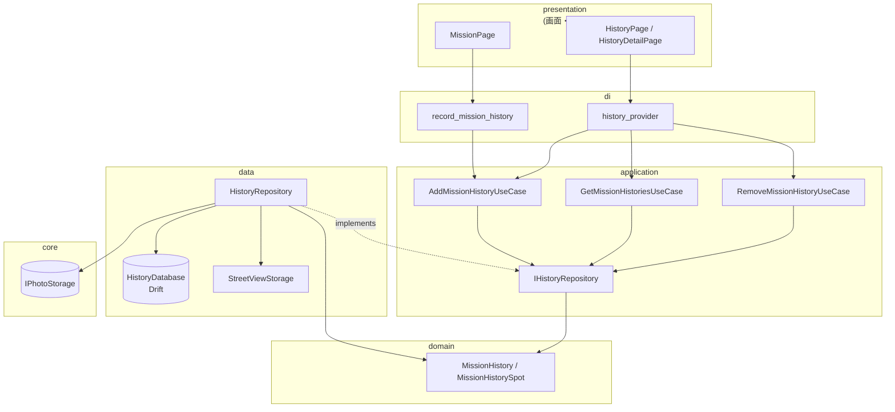
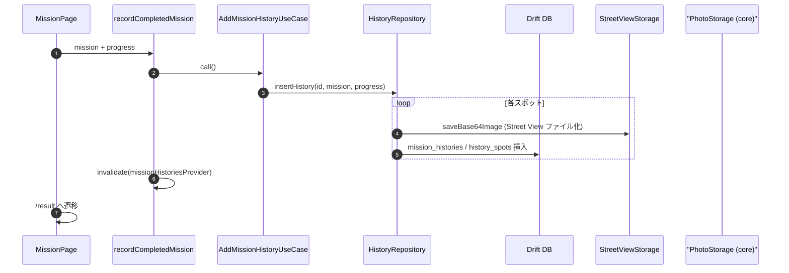
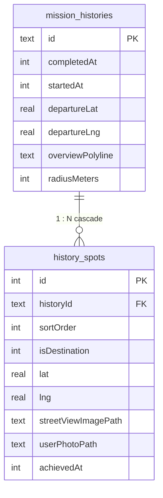
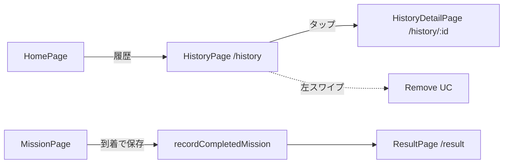

## 概要
ミッション完了後の履歴を保存・閲覧・削除できる機能を追加しました。

関連: #75

## 図解

### レイヤーと依存の向き

### 履歴の追加 (到着ボタン)

### 永続化の形 (DB とファイル)

### 画面とルーティング

### 主な変更
- **Drift (SQLite ORM) による履歴永続化**: `mission_histories` テーブルと `history_spots` テーブルで履歴を構造化して保存
- **クリーンアーキテクチャの導入**: 履歴機能に application / data / domain / di レイヤーを導入
  - `IHistoryRepository` (ポート) → `HistoryRepository` (Drift 実装)
  - `AddMissionHistoryUseCase` / `GetMissionHistoriesUseCase` / `RemoveMissionHistoryUseCase`
- **PhotoStorage の core 移動**: `IPhotoStorage` インターフェースと `PhotoStorage` 実装を `core/storage/` へ移動し、mission と history の両方から利用可能に
- **Street View 画像のファイル保存**: base64 → `history_streetview/` ディレクトリにファイルとして保存し、DB にはパスのみ格納
- **履歴保存タイミングの変更**: `ResultPage` の `useEffect` から `MissionPage` の「到着」ボタン押下時に移動し、保存失敗時のフィードバックを改善
- **履歴一覧・詳細画面**: ホーム画面の「履歴」ボタンから `/history` → `/history/:id` で一覧・詳細を閲覧可能
- **スワイプ削除**: 一覧画面で左スワイプにより履歴と紐づく写真ファイルを削除

### 新規ファイル
| レイヤー | ファイル | 役割 |
|---------|---------|------|
| domain | `mission_history.dart` / `mission_history_spot.dart` | 履歴の表示用エンティティ (freezed) |
| application | `history_repository.dart` (interface) | リポジトリのポート |
| application | `add_mission_history_use_case.dart` 他 | ユースケース群 |
| data | `history_database.dart` | Drift DB 定義 (2 テーブル) |
| data | `history_repository.dart` | Drift CRUD 実装 |
| data | `history_mapper.dart` | Drift 行 ↔ ドメインの変換 |
| data | `streetview_storage.dart` | Street View 画像のファイル保存 |
| di | `history_provider.dart` | Riverpod プロバイダー群 |
| di | `record_mission_history.dart` | mission 側から呼ぶ保存/削除ヘルパー |
| core | `photo_storage_provider.dart` / `photo_storage.dart` / `photo_storage_local.dart` | 共通写真ストレージ |

### 削除ファイル
- `history_persisted_state.dart` (+ freezed / g.dart) — JsonPersist ラッパー
- `mission_history_entity.dart` (+ freezed / g.dart) — 旧エンティティ
- `history_store.dart` (+ g.dart) — 旧 AsyncNotifier
- `mission/application/interface/photo_storage.dart` / `mission/data/photo_storage.dart` — core へ移動

## テスト
- [ ] ホーム → ミッション開始 → 到着 → 結果画面 → ホーム → 履歴一覧に表示されること
- [ ] 履歴一覧から詳細画面に遷移し、地図・写真が表示されること
- [ ] 左スワイプで履歴を削除でき、写真ファイルも消えること
- [ ] アプリ再起動後も履歴が残ること (Drift 永続化)
- [ ] ミッション中に履歴保存が失敗した場合にスナックバーが表示されること

## 備考
- 旧 `JsonPersist` 形式のデータは読み込まず、新規の Drift DB に切り替えています (公開前のため旧データの互換性は不要)
- `drift` / `sqlite3_flutter_libs` / `drift_dev` を依存に追加しています
