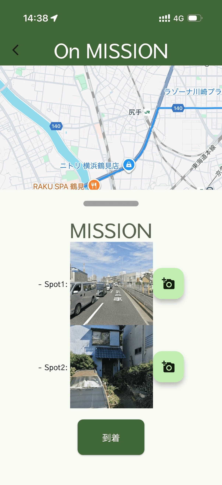

 

<h4 align="center">位置情報と写真撮影を組み合わせた探索型ゲームアプリ 指定された目的地を目指し、正解の写真と同じスポットを探し出そう!</h4>

   
   
   
   

  <a href="#✨-主な機能">主な機能</a> •
  <a href="#📲-使い方">使い方</a> •
  <a href="#💻-開発に参加する">開発に参加する</a> •
  <a href="#👥-クレジット">クレジット</a>

  
  

## ✨ 主な機能

**🌟 日常に冒険のスパイスを 🌟**

スナんぽは、あなたのスマホと足を使って、現実世界を舞台にした探索ゲームです。
いつもの散歩が、未知の目的地への冒険に変わります。
正解の写真を手がかりに、新しい場所を発見し、思いがけない発見と出会いが待っています。

**さあ、あなたも今日から「スナんぽ」を始めて、日常に新しい物語を刻みませんか？** 🚀

### 🎮 スナんぽで体験できること

<table>
<tr>
<td width="50%">

#### 🎲 予測不可能な冒険
現在地からランダムに選ばれた未知の目的地へ。毎回違う場所があなたを待っています

#### 🔍 写真探偵ゲーム
正解の写真と同じスポットを見つけ出せ！観察力と探索心が試される

</td>
<td width="50%">

#### 🏆 2つのミッション
Spot1とSpot2を制覇して、完全制覇を目指そう

#### 🗺️ リアルタイムナビゲーション
Google Mapsで目的地までの道のりを確認しながら、実際に歩いて冒険しよう

</td>
</tr>
</table>

📱 **いつでもどこでも**: iOS/Android対応で、スマホさえあればすぐにプレイ開始

## 📲 使い方

スナんぽはiPhone/Androidでプレイできます。以下の方法でインストールできます。

| 方法                           | 説明                                                                                      | ステータス         |
| ------------------------------ | ----------------------------------------------------------------------------------------- | ------------------ |
| 📦 **リリース版**               | 公式リリース版をダウンロード                                                              | 🚧 準備中           |
| 🧪 **ベータテスターとして参加** | ベータテスターとして参加したい場合は、メールでご連絡ください                              | ✅ 受付中           |
| 🛠️ **自分でホスト**             | 自分でサーバーを立てて利用する場合は、[docs/setup.md](./docs/setup.md) を参照してください | 📖 ドキュメントあり |

## 💻 開発に参加する

スナんぽの開発に参加したい方は、[docs/setup.md](./docs/setup.md) を参照して開発環境を構築してください。

## 👥 クレジット

 

 

**Made with ❤️ by [nakamaware](https://github.com/nakamaware)**

