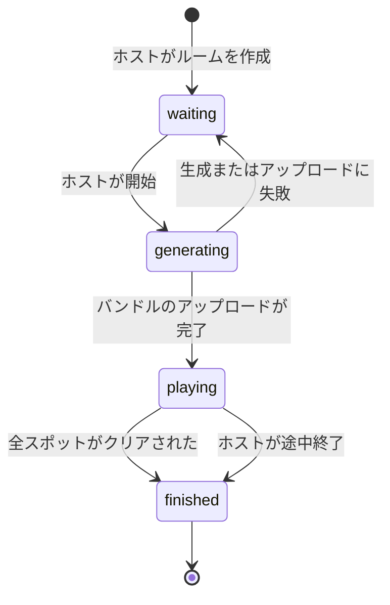
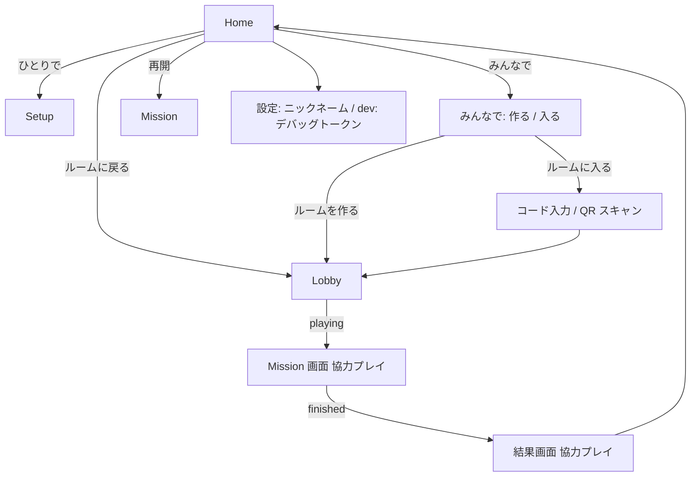

# 協力プレイモード 仕様書 (#249)

> 開発中のみ保持する仕様書です。PR のマージ前 (指示があったタイミング) に削除します。

## 1. 目的

全員が同じミッションを同時に始め、誰かがスポットを見つけたら、すぐに全員の画面でそのスポットがクリアになる一体感をつくります。

- 設計の前提は Notion の設計ロック「協力プレイモードの実装方針 (#249 / KAW-89)」に従う
  - C2 (クリアと発見者の同期)
  - A1 (ルームコードと QR で入室)
  - B1 (Firestore + Cloud Storage)
  - Firebase Auth 匿名 + App Check + Security Rules
  - A5 (端末に GCP IAM を渡さない)
- プレイヤー ID は常に Firebase Auth の `uid`

### スコープ

- 実際に友人と遊べる品質 (エラー時の UI、復帰、期限切れの表示を含む)
- IaC (Terraform)、CI、Security Rules のテストまで含める
- PR は 1 本

### スコープ外

| 項目 | 扱い |
|---|---|
| deep link (Universal Links / App Links) による招待 | #270 |
| ソロプレイの途中終了 | #271 |
| dev の Terraform CD の budget エラー | #257 (修正後に本ブランチへ取り込む) |
| 対戦モード | #250 |
| メール / ソーシャルログイン、account link | 後続 |
| 位置の常時同期 | 後続 |

## 2. 用語

| 用語 | 意味 |
|---|---|
| ルーム | 協力プレイの 1 回分の単位。6 文字のルームコードで識別する |
| ホスト | ルームを作成したプレイヤー (`rooms/{code}.hostId`) |
| メンバー | ルームに入室したプレイヤー (ホストを含む) |
| ミッションバンドル | ホストが生成した、全員で共有する 1 回分のミッション一式 (`bundle.json` とスポット画像) |
| クリア | あるスポットを誰かが撮影したこと。1 人のクリアで全員のクリアになる |
| 発見者 | そのスポットを最初にクリアしたメンバー |
| サムネ | 発見者が撮影した写真を縮小したもの (長辺 480px 程度の JPEG) |
| 遊べる期限 | ルーム作成から 12 時間 (`expiresAt`)。これを過ぎると書き込みをすべて拒否する |
| データの保持期限 | ルーム作成から 7 日 (`deleteAt`)。これを過ぎると Firestore / Storage のデータを自動で削除する |
| ルームに戻る | アプリのキルや電波断のあと、同じ `uid` で進行中のルームへ復帰すること |

## 3. インフラ

### 3.1 GCP / Firebase プロジェクト

- 既存の GCP プロジェクトに Firebase を追加する
  - dev は `snampo-480404`
  - prod は `snampo-prod`
- `terraform/modules/common` に追加し、dev と prod の両方に適用する
  - モジュールを変更すると、CD が両環境に apply する (`terraform-diff-check.yml`)
- Terraform で管理できるものは Terraform で管理する。できないものは「9. 手作業の手順」に書き出す

### 3.2 Terraform で作成するもの

- API の有効化
  - Firebase
  - Identity Toolkit
  - Firestore
  - Firebase Storage
  - App Check
  - Firebase Rules
  - など
- `google_firebase_project`
- Android アプリと iOS アプリの登録
  - Android の `applicationId` は `com.nakamaware.snampo`
  - iOS の bundle id は `com.nakamaware.snampo`
  - iOS の Team は `B263XJUHQS`
- Identity Platform
  - 匿名認証を有効にする
  - **匿名アカウントの自動削除 (autodelete) を明示的に無効にする**。将来、同じ `uid` へ account link し、過去の同行者を表示するため
- Firestore
  - `(default)` データベースを `asia-northeast1` に作る
  - TTL ポリシーの対象は `rooms.deleteAt`
  - TTL はサブコレクションを自動では消さない。`members` と `clears` にも `deleteAt` を持たせ、それぞれの collection group に TTL を設定する
- Cloud Storage
  - バケットは `us-central1` に作る (Always Free の対象リージョン)
  - Firebase にバケットを紐付ける
  - Lifecycle ルールで作成から 7 日後に削除する
- Security Rules
  - `firebase/firestore.rules` と `firebase/storage.rules` を読み、ruleset と release を作る
- App Check
  - Play Integrity と App Attest の設定
  - Firestore と Storage への**強制を最初から有効にする**
- Terraform の SA に必要な権限があれば、合わせて付与する

### 3.3 無料枠とコスト

- Storage を使うため Blaze プランが前提。予算アラートは既存のものを使う (#257 の修正後に機能する)
- 1 ゲームあたりの Firestore 読み取り量の目安は、5 人・26 スポットの最大規模で約 500
  - 無料枠は 1 日 50,000 読み取り
- Firestore に画像のバイナリや Base64 を入れない。入れるのはパスのみ

## 4. アプリへの Firebase 導入

- パッケージ
  - `firebase_core`
  - `firebase_auth`
  - `cloud_firestore`
  - `firebase_storage`
  - `firebase_app_check`
  - `mobile_scanner` (QR の読み取り)
  - QR 生成用のパッケージ (`qr_flutter` など)
- Firebase の設定は、FlutterFire のベストプラクティスに合わせる
  - `lib/core/firebase/firebase_options_dev.dart` と `firebase_options_prod.dart` をコミットし、既存の dart-define `FLAVOR` で切り替える
  - 値は公開値なので、secrets には置かない
  - `google-services.json` と `GoogleService-Info.plist` は使わない
- iOS の App Attest 用に entitlement を追加する (`com.apple.developer.devicecheck.appattest-environment`)

### 4.1 認証

- **アプリ起動時に匿名サインインする** (`signInAnonymously`)
  - 一度サインインすれば `uid` は端末に残り、次回以降はネットワークなしで復元される
- 起動時のサインインが失敗してもユーザーには見せない。ソロプレイは影響を受けずに遊べる
- 「みんなで」を押したときに未サインインなら再試行する
  - 失敗したら理由と「再試行」ボタンを表示する
  - 理由の種類はオフライン、App Check の拒否、その他
- 再試行するのは次の 2 つのイベントのときだけ。定期的なポーリングはしない
  - 「みんなで」を押したとき
  - アプリがフォアグラウンドに復帰したとき

### 4.2 App Check

| FLAVOR | Android | iOS |
|---|---|---|
| `prod` | Play Integrity | App Attest (DeviceCheck へのフォールバックあり) |
| `dev` | Debug provider | Debug provider |

- dev (Debug provider)
  - 設定画面に「App Check デバッグトークン」を表示する (dev ビルドのみ)
    - コピーと共有 (OS の共有シート) ができるようにする
  - トークンはログにも出力する。クラウド上の AI エージェントがログから拾い、人に渡せるようにするため
  - 登録は人が Firebase コンソールで行う。手順は `docs/` に書く
  - 友人向けの dev APK や TestFlight も、端末ごとにこの手順で登録する
  - トークンをコードやリポジトリには置かない
- 拒否されたときの表示
  - dev: 「App Check に拒否されました。設定画面のデバッグトークンを管理者に共有してください」と表示し、設定画面へ誘導する
  - prod: 「この端末では協力プレイを利用できません。ひとりで遊ぶことはできます」と表示し、原因のコードを小さく添える。一時的な失敗もありうるので「再試行」ボタンを残す
  - どちらも「みんなで」の中でだけ表示し、ソロには影響させない
- 注意: Play Console を使っていない現状では、prod の Android ビルドの協力プレイは動かない (Play 経由でインストールしたアプリが前提のため)

## 5. データモデル

### 5.1 スポット ID (バックエンドの変更)

- `/route` のレスポンスの `MidPoint` (中間地点と目的地) に、必須の `spot_id` を追加する
  - 変更対象は `backend/app/api/schemas/route.py`
  - 変更後、`openapi.json` と `packages/snampo_api` を再生成する (`mise run generate-api`)
- 形式
  - ランドマークがあるスポット (中間地点とランダムモードの目的地) は、Places API の `place_id` をそのまま使う
  - 目的地指定モードの目的地は `geo:{lat},{lng}` にする
    - 緯度経度は小数 6 桁に丸める。例: `geo:35.681236,139.767125`
    - RFC 5870 の geo URI に準拠する
    - `place_id` は英数字と `_`、`-` だけでできているので、`:` や `,` を含むこの形式とは衝突しない
    - ID から緯度経度に戻せる
- 一意性の保証
  - 中間地点と目的地のランドマークは `used_place_ids` で重複を除外済み (`generate_route_usecase.py`)
  - 目的地指定モードの目的地は 1 つだけ
- フロントエンドの変更
  - `ImageCoordinate` に `spotId` を追加する
  - 旧データ (ソロの再開データ) を読めるように nullable にする
  - ソロの進捗モデル (並び順のリスト) は変えない

### 5.2 Firestore

```text
rooms/{roomCode}
  hostId: string                 // ホストの Auth uid
  status: 'waiting' | 'generating' | 'playing' | 'finished'
  settings: {                    // ロビーでホストが編集する。メンバーは閲覧のみ
    mode: 'random' | 'destination'
    radius: number?              // random のとき
    destination: { lat, lng }?   // destination のとき
  }
  missionRef: string?            // Storage のバンドルのパス。playing で必須
  spotIds: string[]?             // バンドル内のスポットの並び順
  generationError: string?       // generating が失敗したときの理由
  finishReason: 'allCleared' | 'hostEnded'?
  createdAt: timestamp
  startedAt: timestamp?
  finishedAt: timestamp?
  expiresAt: timestamp           // createdAt + 12h (遊べる期限)
  deleteAt: timestamp            // createdAt + 7d (TTL で削除)

rooms/{roomCode}/members/{uid}
  nickname: string               // 入室時点のニックネーム
  joinedAt: timestamp
  leftAt: timestamp?             // 「ルームを抜ける」で記録する。ドキュメントは削除しない
  deleteAt: timestamp

rooms/{roomCode}/clears/{spotId}
  clearedBy: string              // 発見者の Auth uid
  nickname: string               // 発見時点の発見者のニックネーム
  clearedAt: timestamp
  thumbPath: string              // サムネの Storage パス (サムネを上げてからクリアを作成するので必ずある)
  deleteAt: timestamp
```

### 5.3 Cloud Storage

```text
rooms/{roomCode}/mission/bundle.json            // スポット ID・座標・方角・名前など (画像は含まない)
rooms/{roomCode}/mission/images/{spotId}.jpg    // 目標画像 (base64 をデコードした JPEG)
rooms/{roomCode}/thumbs/{spotId}/{uid}.jpg      // サムネ (発見者ごとにパスを分けて上書きを防ぐ)
```

- `bundle.json` には `MissionEntity` を組み立て直すのに必要な情報 (画像以外) と、各スポットの画像パスを入れる
- 参加者は `bundle.json` を取得してから画像をそれぞれ取得し、`MissionEntity` を組み直す。既存の Mission 画面はそのまま動く
- 同時に撮影して競合に負けた人のサムネは孤児になるが、Lifecycle ルールで 7 日後に消える
- `{spotId}` に `geo:` の `:` と `,` が入る。Storage のパスとして問題ないことを実装時に確認する。問題があればパスの部分だけエンコードする

### 5.4 ルームコード

- 6 文字の英数字大文字
- 紛らわしい文字 (`0` `O` `1` `I` `L`) は除外する
- 作成は create-only (存在しなければ作成)。衝突したら作り直して再試行する
- QR にはアプリ内のスキャナ専用の文字列 `snampo:room:{roomCode}` を入れる

## 6. 状態遷移とゲームのルール



- `waiting`
  - ホストはロビーで設定を変更できる。メンバーは設定をリアルタイムで閲覧のみ
  - 目的地指定モードでは、地図にピンを表示する
- `generating`
  - 開始を押すと、ホストの端末が `/route` を呼ぶ
  - その後、画像と `bundle.json` を Storage へアップロードし、`missionRef` と `spotIds` を書いて `playing` にする
  - 全員の画面に「ミッション生成中」を表示する。ローディングの演出 (Tips やアニメーション) で待ち時間を補う
  - 失敗したら `waiting` に戻し、`generationError` を設定する
    - ホストには理由と「設定を変えて再試行」を表示する
    - メンバーには「ミッションの生成に失敗しました。ホストが再試行します」を表示する
  - アップロードが途中で失敗したら、同じパスに上書きして再試行する (`playing` になるまで参加者は読まないため、不整合は起きない)
- `playing`
  - 全員が Mission 画面へ一斉に遷移する
- `finished`
  - 全員が結果画面へ自動で遷移する
  - 全スポットがクリアされた場合は、クリアを書いた端末が `finished` にする。書き込みが競合しても結果は同じなので、どの端末が書いてもよい
  - ホストが途中終了した場合は、ホストが `finished` にする

### 6.1 クリア

- ランクに関係なく (Miss も含む)、撮影して採点したらクリアになる。撮影したら完了、という既存のソロの挙動と揃える
- **1 人のクリアで全員のクリア**になる。クリア済みのスポットは誰も撮影できない (撮影ボタンを無効にする)
- 先着勝ち: `clears/{spotId}` は作成のみ
  - 同時に撮影して作成に失敗した側は、自分の写真と採点を手元に残す
  - そのうえで「先に○○さんが発見しました」と表示する
- 他の人がクリアしたとき
  - 「○○さんがスポット N を発見!」のバナーを表示する
  - スポットカードに発見者とサムネを表示する
- オフライン中や電波の弱い場所での撮影
  - 共有に失敗したら、そのクリアは失敗にする (送り直しはしない)。「発見を共有できませんでした。電波の良い場所で撮り直してください」と表示する
  - 自分の写真と採点は手元 (進捗と履歴) に残る。発見者は付かないので、同じスポットを撮り直せる
    - 撮影済みの写真に「撮り直す」ボタンを表示する。共有中は撮影できない (同じ発見を並行して送らないため)

### 6.2 サムネのアップロード

1. 撮影してクリアと判定されたら、まずサムネ (長辺 480px、JPEG) を `thumbs/{spotId}/{uid}.jpg` にアップロードする
2. アップロードが終わったら、`thumbPath` を入れて `clears/{spotId}` を作成する
   - 作成はトランザクションで行い、サーバで先着を確かめる。オフラインなら失敗し、端末に書き込みを溜めない
3. サムネのアップロードとクリアの作成が **30 秒**以内に終わらなければ、クリアは失敗にする (6.1 のとおり撮り直してもらう)
   - この間は、撮影した本人の画面に「発見を共有中…」を表示する
   - 既知の制限: 時間切れのあとにサーバへ届いてクリアが作成されることがある。その場合は `clears` の通知で自分が発見者として反映される。通知の前に撮り直したときも自分のクリアとして扱い、サムネは撮り直したものにする (発見日時は最初に届いたクリアの時刻)
4. 他の端末は、`clears` の変更通知 (監視中) か、「8. 同期」の処理で後から取得する

### 6.3 ホストとメンバーの権限

| 操作 | ホスト | メンバー |
|---|---|---|
| 設定の変更 (`waiting` のとき) | ○ | × (閲覧のみ) |
| 開始 | ○ | × |
| 途中終了 (`playing` → `finished`) | ○ | × |
| ルームを抜ける | ○ | ○ |
| スポットのクリア | ○ | ○ |

- ホスト権限は移譲しない
  - ホストがいなくなってもルームは続く
  - 全スポットのクリアか、遊べる期限で終わる
- Firestore は接続が切れたことを検知できないので、「いなくなった」の自動判定はしない

### 6.4 入室、途中参加、復帰、退出

- 入室できるのは `waiting`、`generating`、`playing` のとき
  - `playing` からの途中参加も可。既存の `clears` を読み込んで追いつく
- 人数の上限は `leftAt` のない人で 8 人
  - Rules では強制しない。入室時のチェックとロビーでの表示で守る
  - 既知の制限: メンバーでない人はメンバーを読めないため、入室前に人数を確かめられない。入室してから入室順で上限を確かめ、超えていたら抜けたことにして「満員」と表示する。そのため、満員で入れなかった人もメンバーに残り、ロビーの一覧に抜けた人としてグレーで表示される
- ルームに戻る
  - アプリのキル、電波断、電池切れのあとは、Home に「ルームに戻る」を表示する
  - 同じ `uid` で状態を保ったまま復帰できる。ホストの場合はホスト権限も戻る (`hostId == uid`)
  - 再インストールなどで `uid` が変わった場合は戻れない (許容する)
- ルームを抜ける
  - `members/{uid}.leftAt` を記録する。ドキュメントは削除しない
    - 削除すると「メンバーか」のチェックに通らなくなり、抜けたあとに履歴の画像を同期できなくなるため
    - 書き込みの完了は待たずにホームへ戻る (オフラインでも抜けられるように。送信は SDK が溜めておき、復帰したときに送る)
  - 抜けた人は、クリアの作成と `finished` (`allCleared`) への更新ができない (Rules)
  - ロビーのメンバー一覧では、抜けた人をグレーで表示する
  - 抜けた時点の進捗は履歴に残り、そのあとも同期で更新される
  - 抜けた人が同じルームに入り直すと、`leftAt` を null に戻し、`joinedAt` を入り直した時刻に更新する (ニックネームも入り直した時点のものにする)
    - 人数の上限は入室順で数えるため。入り直した人は、メンバー一覧の最後に並ぶ
    - グレー表示と人数の計算は、入り直した時点で元に戻る
    - 入り直せるのは、入室と同じく `waiting`、`generating`、`playing` のとき
- 期限切れ
  - `expiresAt` を過ぎたルームには入室も書き込みもできない
  - 「このルームは期限切れです」と表示する
  - プレイ中 (Mission 画面) に期限を過ぎたら、期限切れと表示して結果画面へ移る (期限を過ぎると誰も `finished` にできないため)
- プレイ中も Mission 画面の AppBar のメニューから「ルームを抜ける」ができる (確認ダイアログあり)
- 別のルームへ入るときの「今のルームを抜けて参加しますか?」は確認だけで、実際に抜けるのは新しいルームへの入室や作成に成功したとき

### 6.5 ニックネーム

- 新設する設定画面で指定できる。アプリに保存する
- 未設定のままルームを作成または入室しようとしたら、入力を促す。入力した値はアプリに保存する
- 空欄なら自動で命名する (例: 「プレイヤー1234」)
- ルーム内で重複した場合は、表示するときだけ入室順に「たろう(2)」のような番号を付ける
  - 保存するデータは変えない。内部では常に `uid` で区別する

## 7. Security Rules

- 置き場所は `firebase/firestore.rules` と `firebase/storage.rules`
- デプロイは Terraform で行う
- 共通
  - 未認証 (`request.auth == null`) はすべて拒否する
  - App Check はサービス側で強制する

### 7.1 Firestore

| パス | 読み取り | 作成 | 更新 | 削除 |
|---|---|---|---|---|
| `rooms/{code}` | メンバーまたはホスト。入室前の存在確認 (`get`) は認証済みなら可 | 認証済みで `hostId == auth.uid`。create-only で、期限の値は作成時刻から計算した値と一致すること | ホストのみ、遊べる期限内。変更できるフィールドは `status`、`settings`、`missionRef`、`spotIds`、`generationError`、`finishReason`、`startedAt`、`finishedAt`。例外として、全スポットがクリアされたときは抜けていないメンバーも `playing` → `finished` (`allCleared`) に更新できる | 不可 |
| `members/{uid}` | メンバー | 本人 (`uid == auth.uid`) のみ。遊べる期限内 | 本人のみ。`nickname` と `leftAt` だけ変更できる | 不可 |
| `clears/{spotId}` | メンバー | 抜けていない (`leftAt` のない) メンバーで、`status == playing` かつ遊べる期限内。`clearedBy == auth.uid`。`spotId` が `spotIds` に含まれていること。`thumbPath` は必須 | 不可 | 不可 |

- 「全スポットがクリアされたときはメンバーも `finished` にできる」の「全スポットがクリアされたか」は、Rules では検証しない
  - スポットは最大 26 件あり、Rules が 1 回に参照できるドキュメント数の上限を超えるため
  - そのため、メンバーなら `playing` の間いつでも `finished` (`allCleared`) にできてしまう。友人同士で遊ぶ前提なので許容する
- 仕様に加えて、次も Rules で検証する
  - ルームコードは紛らわしい文字を除いた英数字大文字 6 文字であること
  - ルームの `createdAt` は端末の時刻で、サーバの時刻との差が ±10 分以内であること (期限の値は `createdAt` から計算する)
  - ニックネームは 1〜30 文字であること
  - 状態遷移は「6. 状態遷移とゲームのルール」の矢印のとおりであること (`finished` から戻せない)
  - `missionRef`、`spotIds`、`startedAt` を設定できるのは `generating` → `playing` のときだけであること (プレイ中にミッションを変えられない)
  - 抜けた人が入り直すときは、`joinedAt` を更新し、ルームが入室できる状態であること

### 7.2 Storage

| パス | 読み取り | 書き込み |
|---|---|---|
| `rooms/{code}/mission/**` | メンバー (`firestore.get` で members を確認)。期限は見ない | ホストのみ。遊べる期限内 |
| `rooms/{code}/thumbs/{spotId}/{uid}.jpg` | メンバー。期限は見ない | メンバーで、パスの `{uid} == auth.uid`。遊べる期限内。`image/jpeg` で、サイズの上限あり (例: 1MB) |

- 読み取りは「メンバーか」だけを確認し (`get` 1 回)、期限は見ない。読み取り量を抑えるため
- 書き込みは「メンバーか」と「遊べる期限内か」を確認する
- ミッション (`bundle.json` と目標画像) は 5MB まで、かつ `image/jpeg` か `application/json` だけを書き込める

### 7.3 Rules のテスト

- `firebase/` に TypeScript のテストを置く
  - Firebase Emulator Suite と `@firebase/rules-unit-testing` を使う
  - プロジェクト ID は `demo-snampo`
- 最低限、次の観点を確認する
  - メンバーでない人は、クリア、メンバー、画像を読めない
    - ルーム本体は 7.1 のとおり、入室前の存在確認のため認証済みなら `get` できる (一覧の取得はできない)
  - `clears` は 2 回目の作成 (上書き) ができない (先着勝ち)
  - 他人の `uid` を `clearedBy` にして書けない
  - `thumbPath` のないクリアは作成できない。作成したクリアは誰も変更できない
  - 遊べる期限を過ぎたルームには書けない。保持期限内なら読める
  - `status` と `settings` の変更はホストだけ (全スポットがクリアされたときの `finished` は例外)
  - サムネは自分の `uid` のパスにしか上げられない。ミッション画像はホストしか上げられない
  - 未認証のアクセスはすべて拒否する
- CI: `.github/workflows/ci-frontend.yml` に `rules-test` ジョブを追加する
  - トリガーのパスに `firebase/**` を足す
  - Node.js と Java を用意し、`firebase emulators:exec` で実行する

## 8. 同期と履歴

基本方針は「**サーバ (`clears`) が正で、端末は差分を取りにいく**」です。1 つの同期処理で、次のケースをすべて扱います。

| ケース | 取得のタイミング |
|---|---|
| ずっと参加している | `clears` の通知 (追加) が届いた時点で、サムネを取得してキャッシュする |
| 一時的に抜けて、ルームに戻った | 戻ったときの `clears` の全件スナップショットとキャッシュを比べ、不足分をまとめて取得する |
| 抜けたまま戻らない (抜ける、キル、電池切れ) | アプリの起動時と履歴画面を開いたときに、保持期限 (7 日) 内で未確定の協力プレイ履歴について、`clears` と `rooms` を 1 回だけ取得する (監視はしない)。不足分を取得し、発見者とサムネを更新する。ルームが `finished` で発見者のサムネが全部そろったか、遊べる期限を過ぎていれば「確定」にして、以後は取りにいかない (`finished` のあとも、サムネの取得に失敗していれば次の同期で取り直すため) |
| 7 日以上アプリを開かなかった | データが消えているので、取得できなかった分はプレースホルダを表示する |
| サムネを遊べる期限内に取得できなかった | プレースホルダを表示する |

- ミッション画像は、ルームに入ってダウンロードした時点ですべてローカルに保存する。途中で抜けても履歴に残る
- 取得したサムネと画像は、既存の履歴の保存先 (`history_photos/`、`history_streetview/`) に乗せる

### 8.1 履歴 (Drift)

- 協力プレイの履歴は、`playing` に遷移した時点で「進行中」として作成する
- その後は `roomCode` をキーに upsert する。ソロは既存どおり、完了時に 1 回だけ保存する
- スキーマの変更 (schemaVersion 3 → 4 へのマイグレーション)
  - `mode` に `coop` を追加する
  - 協力プレイの情報
    - `roomCode`
    - 同期の状態 (進行中、確定)
    - 自分がホストだったか
    - メンバー一覧 (`uid` とニックネーム)
  - スポットごとの情報
    - `spotId`
    - 発見者の `uid` とニックネーム
    - サムネのローカルパス
    - クリア済みかどうか (途中終了の場合、未クリアのスポットがある)
- `uid` は将来の account link と「過去に一緒に遊んだ人」の機能のために保存する

## 9. 画面とフロー



- Home
  - 「ひとりで」 (既存の START) と「みんなで」を並べる
  - 進行中のミッションがあれば「再開 (ソロ)」を、進行中のルームがあれば「ルームに戻る」を表示する
- 設定画面 (新設)
  - ニックネームの編集
  - dev ビルドだけ、App Check のデバッグトークンの表示 (コピーと共有)
- みんなで
  - サインインと App Check のエラーは、ここで表示する (4.1、4.2)
  - 未設定ならニックネームの入力を促す
  - 「ルームを作る」か「ルームに入る」を選ぶ
- ルームに入る
  - コード入力と QR スキャン (`mobile_scanner`)
  - 期限切れ、存在しないコード、満員、終了済みはそれぞれエラーを表示する
- ロビー
  - ルームコードと QR を表示する。コードのコピーと OS の共有シートでの共有ができる
  - メンバー一覧 (抜けた人はグレー、重複した名前には番号を付ける)
  - 設定 (ホストは編集、メンバーは閲覧のみ。既存の Setup の UI を流用する)
  - ホストに開始ボタンを表示する
  - `generating` のときはローディング演出を表示する
    - `generating` のままホストのアプリが落ちた場合に備え、ホストは確認ダイアログのうえで生成をやり直せる
  - 「ルームを抜ける」
- Mission 画面 (既存を拡張)
  - セッション種別 (`solo` / `coop`) を受け取る
  - 協力プレイのときだけ、次を表示する
    - 発見者とサムネ
    - 発見バナー
    - クリア済みのスポットの撮影を無効にする
    - 「発見を共有中…」
    - 途中終了 (ホストのみ、確認ダイアログあり)
- 結果画面 (既存を拡張)
  - スポットごとに発見者とサムネを表示する
  - 未クリアのスポットも表示する (共有に失敗した自分の写真があっても、発見者がいなければプレースホルダ)
  - 発見数ランキング (誰が何個見つけたか) を表示する
- ルーティングは `lib/core/router.dart` に追加する。deep link は #270 で扱う

### 9.1 ソロとの共存

- 保存枠は、ソロ 1 枠 + 協力プレイ 1 枠
- ミッションと進捗のストア (`PersistedMission`、`MissionProgressStore`) を、セッション種別 (`solo` / `coop`) で family 化して保存キーを分ける
  - ソロの既存データは、そのまま `solo` として読めるようにする (マイグレーション不要のキー設計)
- 撮影写真の保存先を分ける
  - ソロは `mission_photos/solo/`
  - 協力プレイは `mission_photos/coop/{roomCode}/`
  - 既存のソロの写真のパスは、そのまま読めるようにする
- 協力プレイの進捗に、他の人のクリアを「発見者情報つき・自分の写真なし」として反映する
- 結果画面の「ホームへ戻る」で片付ける対象は、その種別の枠だけにする
- 協力プレイ中に別のルームへ入ろうとしたら、「今のルームを抜けて参加しますか?」と確認する
  - 抜けた前のルームは `leftAt` を記録し、履歴の同期は続ける

## 10. 手作業の手順 (`docs/` に書く)

- App Check のデバッグトークンの登録 (Firebase コンソール)
  - 設定画面かログからトークンを取得し、管理者に共有し、登録するまで
- Apple Developer で App ID の App Attest capability を有効にする (必要な場合)
- dev の Terraform CD が #257 で失敗している間は、Firebase のリソースも apply 自体はされる (budget 以外)。それでも失敗したら、ローカルから apply する手順
- Firebase の設定ファイル (`firebase_options_*.dart`) を Terraform の output から更新する手順
- 料金表の再確認 ([Firebase Pricing](https://firebase.google.com/pricing/))

## 11. テスト方針

- Flutter: domain と usecase の単体テスト (既存の `frontend/test/` の方針に揃える)
  - ルームコードの生成と検証
  - スポット ID のエンコードとデコード (`place_id` と `geo:`)
  - ニックネームの自動命名と重複時の番号付け
  - 同期の差分計算 (`clears` とローカルのキャッシュ)
  - 状態遷移の判定 (全スポットのクリアで `finished` になるか)
  - クリアの共有 (サムネの失敗や時間切れでクリアを失敗にするか)
  - 履歴の mapper (`coop`)
- Security Rules: 7.3 のとおり (エミュレータ、CI)
- backend: `spot_id` の生成 (`place_id` と `geo:`) の pytest
- 実機で次を確認する (Notion のスパイク成功条件)
  1. ホストがルームを作り、QR かコードで参加者が入室できる
  2. 全員が同じミッションとスポット画像を表示できる
  3. どれかの端末でクリアすると、数秒以内に他の端末へ発見者付きで反映される
  4. ミッション画像は Firestore に入らず、Cloud Storage 経由で読める
  5. 各端末の `playerId` が Auth の `uid` で、Rules と App Check を通して読み書きできる

## 12. 決定の経緯 (要約)

| 論点 | 決定 | 理由 |
|---|---|---|
| ロビーと開始 | 状態あり。ホストの開始で一斉に遷移する | 同時に始める一体感を出すため |
| 生成のタイミング | 開始を押した後 | 集まっている間に設定が変わりうるため |
| スポット ID | `place_id` / `geo:` をバックエンドで付与する | 将来、履歴などで場所を識別できるようにするため |
| バンドル | JSON と画像ファイルに分ける | Firestore の上限を避け、base64 の膨張をなくすため |
| クリアの定義 | 撮影すればクリア (ランクは問わない) | 既存のソロの挙動に揃えるため |
| サムネ | 先にアップロードし、失敗したらクリアも失敗にする (送り直さない) | サムネのないクリアや送り直しの状態をなくし、仕組みを単純にするため (撮り直してもらう) |
| 期限 | 遊べる期限 12 時間と、保持期限 7 日を分ける | 戻らなかった人の履歴も救うため |
| Firebase の設定 | Dart ファイルをコミットする | 公開値であり、公式のベストプラクティスのため |
| App Check (dev) | 端末ごとのデバッグトークンを人が登録する | 共通トークンは漏れたときのリスクがあり、コードで管理したくないため |
| サインイン | 起動時 | 将来、ログインを必須にする前提のため |
| QR | アプリ内スキャン専用の文字列 | deep link は #270 に分けるため |
| ソロとの共存 | 別枠 (family 化) | ソロの進行中ミッションを失わないため |
